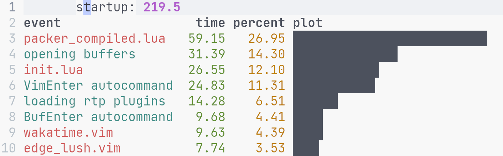

## Neovim

### How to

#### Profile

First run

```vim
:let g:startuptime_exe_args=["-u", expand("~") . "/lib/LunarVim/init.lua", "/etc/fstab"]
```

It will generate the following


To check `packer_compiled.lua`

```vim
:PackerCompile profile=true
" relaunch
:PackerProfile
```

To check `opening buffers`, though no time info

```vim
" optional verbose
:autocmd BufRead,BufEnter
:autocmd BufWinEnter
```

For manually loaded packages using `require("core.utils").load_pack`

```lua
-- put this before `load_pack` is used
myvim.profile.enable = true
-- relaunch
```

Check the result

```vim
:lua print(vim.inspect(myvim.profile.infos))
```

#### Debug

View source order

```sh
nvim -V
```

### Resources

#### Coding

- [lua-async](https://github.com/ms-jpq/lua-async-await)
- [Learn X in Y minutes](https://learnxinyminutes.com/docs/lua/)
- [nvim-lua-guide](https://github.com/nanotee/nvim-lua-guide)

### Tricks

- When use telescope, [fzf syntax](https://github.com/nvim-telescope/telescope-fzf-native.nvim#telescope-fzf-nativenvim) is supported
- `:lua ={{expr}}` for pretty print
- In dap-repl, omnifunc is set. So we can use `<c-x><c-o>` for completion

### Lvim

- [High level script order](https://github.com/LunarVim/LunarVim/issues/1548#issuecomment-920244451)
